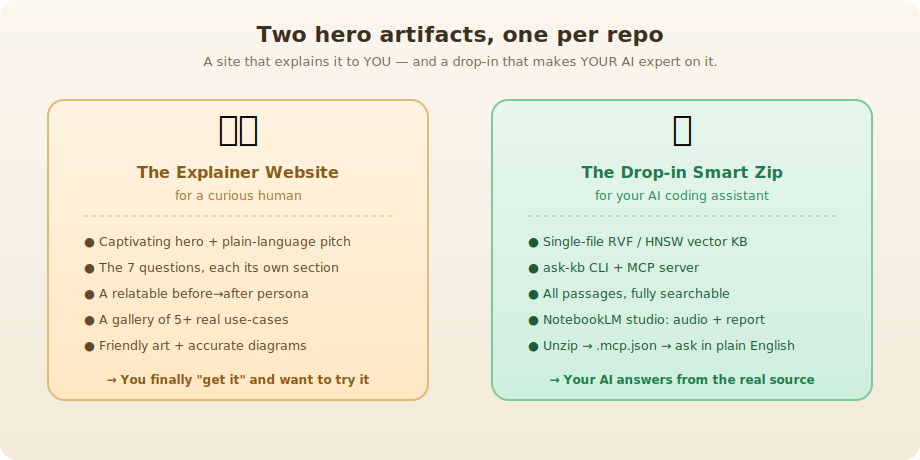
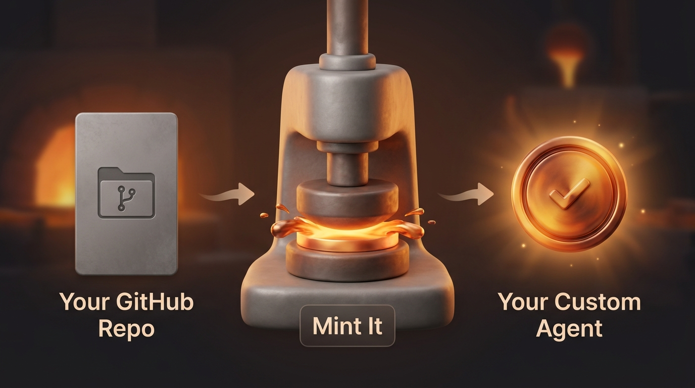
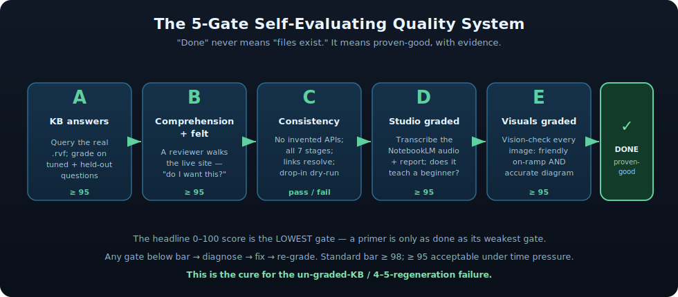

<div align="center">

# Ruv-Explainer

### A "Repo-Primer Pipeline" that turns Reuven Cohen's dense, powerful repos into approachable explainers — for humans *and* for your AI.

*Power tools deserve handles. This builds them.*


**4 live explainers · [browse them below ↓](#-the-tools-weve-explained-so-far)**

</div>

---

## What is this?

[Reuven Cohen](https://github.com/ruvnet) (**@ruvnet**, "ruv") ships brilliant, genuinely novel software at a remarkable pace. The problem: the repos are *dense*. They're written by an expert, for experts, and a newcomer who lands on one often can't tell what it is, what it's for, or how to begin.

**Ruv-Explainer is an independent project that fixes that one repo at a time.** It's a repeatable pipeline — a "**Repo-Primer Pipeline**" — that takes an under-documented ruvnet repo and produces two things a newcomer actually needs:

1. **A beautiful explainer website** that teaches *you*, a curious human, what the tool is and why you'd want it.
2. **A drop-in "smart zip"** that makes *your own AI assistant* instantly expert on that exact repo.

> **To be clear:** the tools being explained are **Reuven Cohen's**. Ruv-Explainer is **not** affiliated with him — it's an independent effort built to help more people discover, understand, and adopt his work.

---

## Why was it built?

Ruv ships **power tools without handles.**

The work is excellent. But the READMEs are written at the speed of someone who already understands the idea completely — so they're terse, deeply technical, and assume a lot. A non-technical person (or even a technical person new to the subject) opens the repo, reads three paragraphs of jargon, and quietly closes the tab. A genuinely useful tool goes unused, not because it's bad, but because nobody could find the door.

This project is the door. It meets newcomers where they live: plain language first, a friendly picture before any wall of text, one relatable real-world example before any command, and honest answers to the questions people actually have — *"what does this do, why do I care, and how do I start?"*

---

## Who is it for?

This README — and everything the pipeline produces — speaks to **two readers at once:**

| You are... | You want to... | Start here |
|---|---|---|
| 🧑‍💻 **A curious newcomer** (non-technical, maybe a Claude Code / Cursor user) who keeps seeing ruvnet's powerful repos and wants to understand them | *Get your head around what a tool is and whether it's for you* | The [gallery of live explainers ↓](#-the-tools-weve-explained-so-far) — pick one and read it like a story |
| 🛠️ **A builder** who wants to run this pipeline on more repos | *Produce the same dual-audience explainer for another repo* | [The recipe ↓](#the-recipe-how-it-works) and [How to run it ↓](#how-to-run-it-on-a-new-repo) |

---

## What does it produce? The two hero artifacts

Every repo we process ships **two** things — neither optional, both quality-gated. One is for a person; one is for that person's AI.




<details>
<summary>ASCII Version (for AI/accessibility)</summary>

```
                Two hero artifacts, one per repo
   A site that explains it to YOU - and a drop-in that makes YOUR AI expert on it.

  +-------------------------------+     +-------------------------------+
  |   THE EXPLAINER WEBSITE       |     |    THE DROP-IN SMART ZIP      |
  |   (for a curious human)       |     |  (for your AI assistant)      |
  |-------------------------------|     |-------------------------------|
  | - Captivating hero + pitch    |     | - Single-file RVF/HNSW KB     |
  | - The 7 questions, in order   |     | - ask-kb CLI + MCP server     |
  | - A before->after persona     |     | - All passages, searchable    |
  | - 5+ real use-cases           |     | - NotebookLM studio:          |
  | - Friendly art + diagrams     |     |     audio overview + report   |
  |                               |     | - Unzip -> .mcp.json -> ask   |
  | => You "get it" + want to try |     | => AI answers from real source|
  +-------------------------------+     +-------------------------------+
```

</details>

**(a) The explainer website — so a human gets it.**
A self-contained site that opens with a captivating visual and a one-sentence plain-language pitch, then walks you through the seven questions a newcomer actually asks (Why was it built? What problem does it solve? Why now? How does it work? What does "solved" look like? How would I implement it? How do I start?). It anchors on one **relatable, named persona** with a real before→after, then offers a gallery of 5+ concrete use-cases. *How you use it:* read it like a short illustrated story — no setup, nothing to install. By the end you can say what the tool does and whether you want it.

**(b) The drop-in smart zip — so your AI gets it.**
A single download with two halves. The `for-ai/` half is a **single-file RVF / HNSW vector knowledge base** (384-dimensional, embedded locally with `bge-small` — no API, no server) of the repo's *own* code and docs, plus an `ask-kb` command-line tool and an **MCP server** you wire into Claude Code or Cursor. The `for-humans/` half includes the primer **and the NotebookLM studio media** — an audio overview and a written report. *How you use it:* unzip it into your project as `kb/`, add a two-line `.mcp.json`, and now when you ask your AI assistant about that tool, it answers from the **real source** instead of guessing. (Play the audio overview first — it's the fastest way in.)

---

## 🖼️ The tools we've explained so far

Four live explainers, each its own public site and repo. Click a **Live explainer** link, read it, and you'll understand the upstream tool in minutes. Each card also links the explainer's own GitHub repo and **Reuven Cohen's upstream repo** it's based on.

### MetaHarness

[](https://metaharness-explainer.vercel.app)

> **Gives any project its own AI assistant that actually knows *that* project — built for you in about a minute, instead of by an expert over days.** An AI assistant is a brilliant generalist, but out of the box it's never seen your code, so it guesses. MetaHarness hands your AI a memory of your project, the right skills, and guardrails — automatically.

🔗 **Live:** <https://metaharness-explainer.vercel.app> · 📁 **Explainer repo:** [stuinfla/metaharness-explainer](https://github.com/stuinfla/metaharness-explainer) · ⚡ **Upstream:** [ruvnet/agent-harness-generator](https://github.com/ruvnet/agent-harness-generator)
*(Repo name `agent-harness-generator` ships as the CLI `metaharness` — same tool.)*

### PhotonLayer

[](https://photonlayer-explainer.vercel.app)

> **A deterministic optical-AI front end: a learned phase mask shapes light so a tiny sensor captures the *answer*, not the picture.** Instead of taking a photo and then running it through a model, the optics themselves do part of the computation — at the speed of light, before any chip wakes up.

🔗 **Live:** <https://photonlayer-explainer.vercel.app> · 📁 **Explainer repo:** [stuinfla/photonlayer-explainer](https://github.com/stuinfla/photonlayer-explainer) · ⚡ **Upstream:** [ruvnet/PhotonLayer](https://github.com/ruvnet/PhotonLayer)

### ruqu

[](https://ruqu-explainer.vercel.app)

> **A fast quantum-computing simulator in Rust + WebAssembly — build and run quantum algorithms with no quantum hardware, right in your browser.** It lets you learn, prototype, and test quantum circuits today, without waiting for (or paying for) a real quantum machine.

🔗 **Live:** <https://ruqu-explainer.vercel.app> · 📁 **Explainer repo:** [stuinfla/ruqu-explainer](https://github.com/stuinfla/ruqu-explainer) · ⚡ **Upstream:** [ruvnet/ruqu](https://github.com/ruvnet/ruqu)

### ruvn

[](https://ruvn-explainer.vercel.app)

> **An AI research engine: turns a question into a graded, cited evidence dossier.** Instead of one confident paragraph, you get a structured report — sources gathered, weighed, and graded — so you can actually trust (and check) the answer.

🔗 **Live:** <https://ruvn-explainer.vercel.app> · 📁 **Explainer repo:** [stuinfla/ruvn-explainer](https://github.com/stuinfla/ruvn-explainer) · ⚡ **Upstream:** [ruvnet/ruvn](https://github.com/ruvnet/ruvn)

---

## The recipe (how it works)

The whole point of Ruv-Explainer is that it's a **repeatable recipe**, not a one-off. Build one repo's primer to a proven standard, then replay the identical pipeline on the next.


<details>
<summary>ASCII Version (for AI/accessibility)</summary>

```
                       The Repo-Primer Pipeline
   One under-documented repo in -> two approachable, proven-good artifacts out

 +-------------+     +------------------+     +-------------------+     +----------------+
 |  Upstream   | --> |      BUILD       | --> |  5 QUALITY GATES  | --> | Explainer site |
 |   repo      |     | 1 ingest tree    |     |  A KB answers     |     |  (for humans)  |
 | @ruvnet's   |     | 2 384-dim RVF KB |     |  B comp. + felt   |     +----------------+
 | dense       |     | 3 explainer site |     |  C consistency    |     | Smart zip      |
 | power tool  |     | 4 NotebookLM     |     |  D studio graded  | --> |  (for your AI) |
 +-------------+     |   studio         |     |  E visuals graded |     +----------------+
                     +------------------+     |  each >=95 ->     |
                                             |  done=proven-good |
                                             +-------------------+

 Evergreen: a cron poll rebuilds only when the upstream repo's commit SHA moves.
 Then deploy public to Vercel and verify the live site returns HTTP 200.
```

</details>

Per repo, the pipeline:

1. **Ingests the upstream repo** — only the tool's *own* authored tree (it reads `.gitmodules` and skips vendored/nested submodule code, so a primer never accidentally teaches some *other* tool's internals).
2. **Builds a single-file RVF knowledge base** — embedding the repo's code and docs locally with `bge-small` (384-dim), using **structure-aware chunking** (split at function/heading boundaries, keep doc-comments with their symbol). At this scale, chunking quality matters more than the embedding model.
3. **Authors the explainer site** — image-first (every section opens with its visual, *then* words), with **dual-level visuals** in every section (a friendly illustration *and* an accurate, source-true SVG diagram), a resonant before→after persona, an honest "why this over what I already have?" differentiation, and **prominent attribution** to Reuven Cohen / @ruvnet on the first screen.
4. **Builds the NotebookLM studio** — its own notebook, an audio overview and a report, authored with optimized prompts.
5. **Runs the 5-gate Self-Evaluating Quality Gate** (below) — and only declares "done" when it passes *with evidence*.
6. **Deploys public** (its own GitHub repo + Vercel site, `-explainer` suffix) and **verifies the live URL returns HTTP 200** — proving the fix actually shipped, never asserting it.

### The 5 gates — "done = proven-good, with evidence"

The hard-won rule behind this project: **"done" never means "the files exist."** On an early build, knowledge bases shipped *un-graded* and needed 4–5 regeneration cycles to get right. So now the build **evaluates its own output** and only passes when every gate clears its bar.



<details>
<summary>ASCII Version (for AI/accessibility)</summary>

```
              The 5-Gate Self-Evaluating Quality System
   "Done" never means "files exist." It means proven-good, with evidence.

  +------------+   +--------------+   +-------------+   +-------------+   +-------------+   +------+
  |     A      |-> |      B       |-> |     C       |-> |     D       |-> |     E       |-> | DONE |
  | KB answers |   | comprehension|   | consistency |   |   studio    |   |  visuals    |   |  ()  |
  |            |   |   + felt     |   |             |   |   graded    |   |  graded     |   |proven|
  | query real |   | reviewer     |   | no invented |   | transcribe  |   | vision-check|   | good |
  | .rvf;      |   | walks the    |   | APIs; all 7 |   | the audio   |   | every image:|   +------+
  | tuned +    |   | live site -  |   | stages;     |   | + report;   |   | friendly    |
  | held-out   |   | "do I want   |   | links;      |   | teaches a   |   | on-ramp AND |
  | questions  |   |  this?"      |   | dry-run     |   | beginner?   |   | accurate dgm|
  |   >=95     |   |    >=95      |   | pass/fail   |   |    >=95      |   |    >=95      |
  +------------+   +--------------+   +-------------+   +-------------+   +-------------+

  The headline 0-100 score is the LOWEST gate - a primer is only as done as its weakest gate.
  Any gate below bar -> diagnose -> fix -> re-grade. Standard bar >=98; >=95 under time pressure.
  This is the cure for the un-graded-KB / 4-5-regeneration failure.
```

</details>

| Gate | What it checks | How it passes |
|---|---|---|
| **A — KB answer-quality** | The real `.rvf` is queried with a fixed set *and* a held-out set; graded on retrieval relevance + answer correctness vs. source. | Deterministic score ≥ 95 on **both** sets. Never ship an un-graded KB. |
| **B — Comprehension + felt** | A reviewer actually *renders and walks the live site* as the newcomer persona — then answers three honest "felt" questions: *Does this impress me? Invite me in? Make me want to use it?* | All three felt questions "yes"; a "no" is a fail, not a nitpick. |
| **C — Consistency + drop-in dry-run** | Claims grounded in source (no invented APIs), all 7 stages present, ≥5 use-cases, links resolve, and the smart zip loads + returns a grounded answer. | Pass / fail. |
| **D — Studio graded** | The NotebookLM audio + report are *transcribed and read* (never assumed) and graded for clarity, comfort, confidence, completeness. | Score ≥ 95. |
| **E — Visuals graded** | Every image is vision-checked — and must span **two tiers**: a friendly raster on-ramp *and* an accurate, source-true SVG architecture diagram. | Score ≥ 95. Friendly-but-not-explanatory fails. |

The headline score is the **lowest** gate — a primer is only as done as its weakest gate. The standard bar is **≥ 98**; **≥ 95** is acceptable under genuine time pressure. The full set of binding constraints (A–BB) lives in the recipe documents:

- 📐 **The recipe (ADR):** [`docs/adr/0001-repo-primer-pipeline.md`](docs/adr/0001-repo-primer-pipeline.md) — Part I (pipeline architecture) + Part II (explainer site + the 5-gate quality system), with all constraints A–BB.
- 🧩 **The domain model (DDD):** [`docs/ddd/repo-primer-domain-model.md`](docs/ddd/repo-primer-domain-model.md) — the ubiquitous language, bounded contexts, aggregates, and invariants.

---

## How to run it on a new repo

The high-level loop, pointing at the real files in this repo:

1. **Configure the target** — add a per-repo config under [`config/repos/`](config/repos/) (submodule path, NotebookLM notebook id, embed model, scope-exclusion patterns).
2. **Build + grade the KB** — the [`kb/`](kb/) scripts build the single 384-dim RVF (`kb/build-single-384.mjs`), then **grade it** (`kb/grade-kb.mjs` + `kb/gate.mjs`) on tuned + held-out questions (`kb/questions/`). This is **Gate A** — don't proceed until it's green.
3. **Build + gate the site** — author the explainer site (image-first, dual-level visuals, resonant persona, prominent attribution), then run **Gates B/C/E** by rendering and walking the live site.
4. **Build the studio** — create the repo's NotebookLM notebook, generate the audio overview + report with optimized prompts, and grade them (**Gate D**).
5. **Deploy + verify** — ship to its own public GitHub repo + Vercel site, then `curl -sI` the real URL for HTTP 200. Record the whole walk in [`docs/build-journal/`](docs/build-journal/) — config, gate scores, fixes, and deploy proof. A primer with no journal entry isn't finished.

> 🆕 **New here? Start with [`START-HERE.md`](START-HERE.md).** It's the orientation doc for the repo's own contributors.

---

## Tech stack

| Layer | Tool | Why |
|---|---|---|
| **Vector knowledge base** | [`@ruvector/rvf`](https://www.npmjs.com/package/@ruvector/rvf) — RVF single-file HNSW vector DB | One file, zero server, zero Docker. Drops into any project. |
| **Embeddings** | `Xenova/bge-small-en-v1.5` (384-dim, local ONNX) | Strong retrieval model, runs on a laptop, **no external API**. |
| **Human-half media** | [NotebookLM](https://notebooklm.google.com/) via the `nlm` CLI | Audio overview + report that teach a true beginner. |
| **Hosting** | [Vercel](https://vercel.com/) | Git-connected, auto-deploy, public, instant preview URLs. |
| **Orchestration** | Ruflo | Capacity-aware parallel swarms (one per repo) for the scale phase. |
| **Site craft** | image-first design, dual-tier visuals, hand-authored SVG diagrams | Beats a plain README by meeting both a newcomer *and* a technical reader in the same section. |

---

## Credit & provenance

**The tools explained here belong to [Reuven Cohen / @ruvnet](https://github.com/ruvnet).** All the credit for the underlying technology — MetaHarness, PhotonLayer, ruqu, ruvn, and the rest — is his.

**Ruv-Explainer is an independent project.** It is not affiliated with or endorsed by Reuven Cohen. It exists for one reason: to help more people discover, understand, and actually adopt his work — by giving each powerful repo the handle it was missing.

If these explainers help you get into a tool you'd otherwise have bounced off of, go star the **upstream** repo, and go build something with it. That's the whole point.

---

<div align="center">

**Built with the Repo-Primer Pipeline** · [github.com/stuinfla/Ruv-Explainer](https://github.com/stuinfla/Ruv-Explainer)
*Explaining [@ruvnet](https://github.com/ruvnet)'s power tools, one handle at a time.*

</div>
